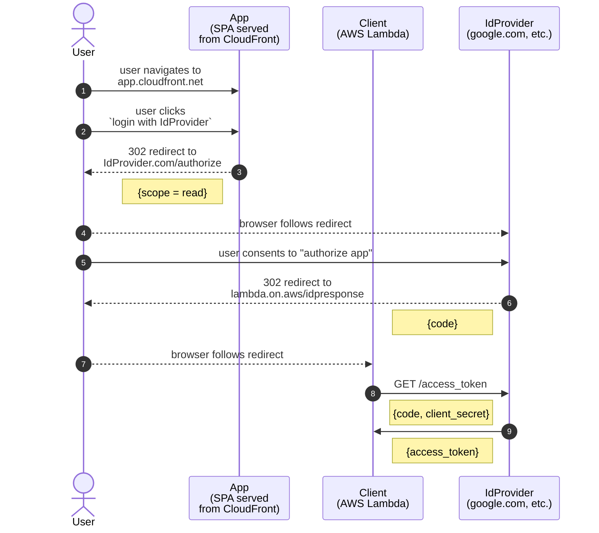

```mermaid
sequenceDiagram
autonumber
actor user as User
participant app as App<br/>(SPA served<br/>from CloudFront) 
participant client as Client<br/>(AWS Lambda)
participant idp as IdProvider<br/>(google.com, etc.)

user->>app: user navigates to <br/>app.cloudfront.net
user->>app: user clicks<br/>`login with IdProvider`
app-->>user: 302 redirect to<br/>IdProvider.com/authorize
note left of app: {scope = read}

user-->>idp: browser follows redirect
user->>idp: user consents to "authorize app" 
idp-->>user: 302 redirect to<br/>lambda.on.aws/idpresponse
note left of idp: {code}
user-->>client: browser follows redirect

client->>idp: GET /access_token
note right of client: {code, client_secret}
idp->>client: 
note left of idp: {access_token} 
```
