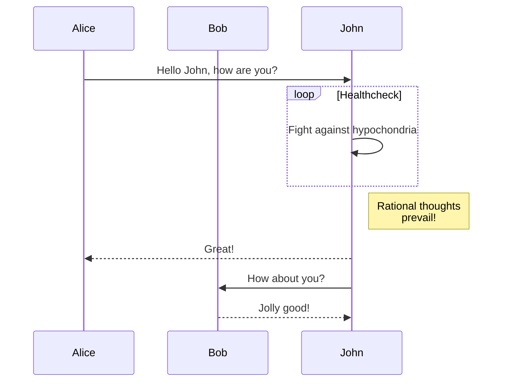

```mermaid
C4Context
    title System Context diagram for Internet Banking System

    ' uncomment the following line and comment the first to use locally
    ' !include C4_Container.puml
    ' LAYOUT_TOP_DOWN()
    ' LAYOUT_AS_SKETCH()
    LAYOUT_WITH_LEGEND()
    title C4 Container diagram for Raido
    Container(AppClient, "app-client", "Raido UI React/SPA") 
    Container(ApiSvc, "api-svc", "Spring REST API") 
     
    Person(PublicUser, "Public User", )
    Person(SpUser, "ServicePoint User", )
    
    Rel(PublicUser, AppClient, "interact")
    Rel(SpUser, AppClient, "interact")
    Rel(AppClient, ApiSvc, "invoke")

```