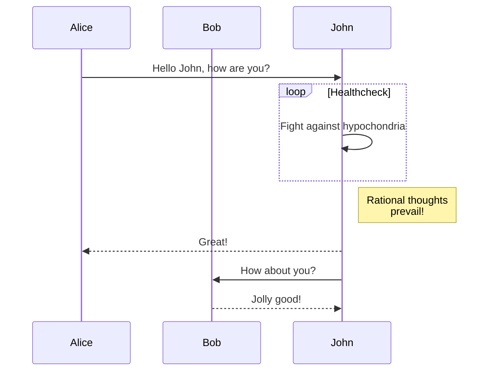
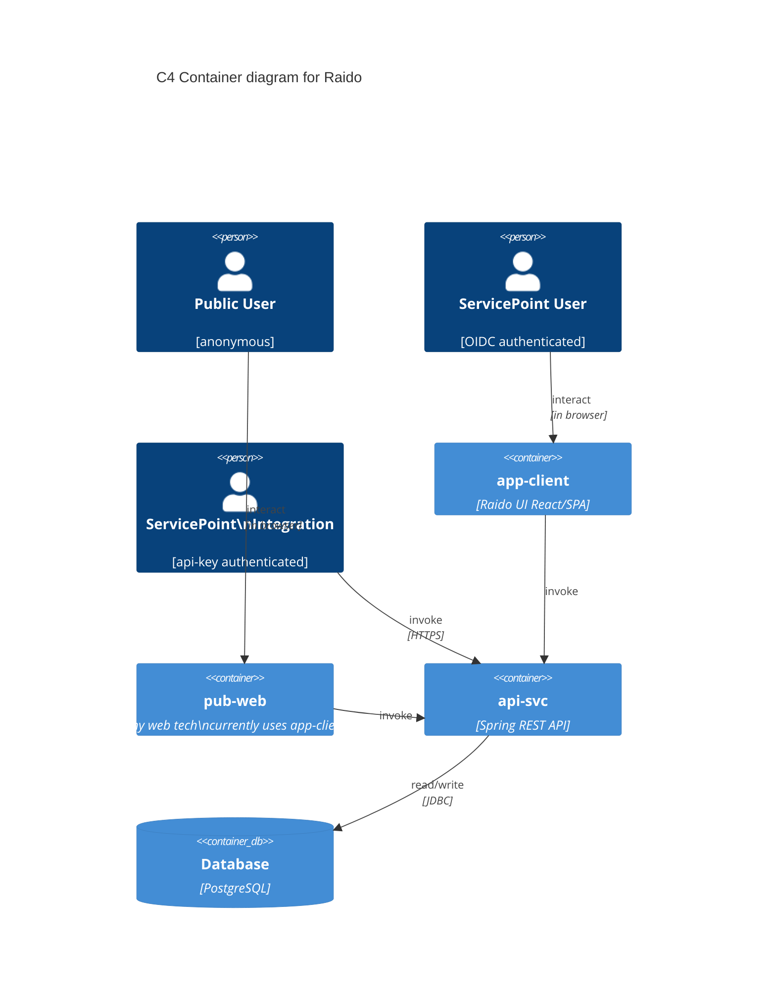

```mermaid
sequenceDiagram
    participant Alice
    participant Bob
    Alice->>John: Hello John, how are you?
    loop Healthcheck
        John->>John: Fight against hypochondria
    end
    Note right of John: Rational thoughts <br/>prevail!
    John-->>Alice: Great!
    John->>Bob: How about you?
    Bob-->>John: Jolly good!
```

```mermaid
C4Context
    title C4 Container diagram for Raido
    
    Person(PublicUser, "Public User", "[anonymous]")
    Person(SpUser, "ServicePoint User", "[OIDC authenticated]")
    Person(SpInt, "ServicePoint\nIntegration", "[api-key authenticated]")
    
    
    Container(AppClient, "app-client", "Raido UI React/SPA") 
    Container(PubWeb, "pub-web", "any web tech\ncurrently uses app-client") 
    
    Container(ApiSvc, "api-svc", "Spring REST API") 
    ContainerDb(db, "Database", "PostgreSQL")
     
    
    Rel(PublicUser, PubWeb, "interact", "in browser")
    Rel(SpUser, AppClient, "interact", "in browser")
    Rel(AppClient, ApiSvc, "invoke")
    Rel(PubWeb, ApiSvc, "invoke")
    Rel(SpInt, ApiSvc, "invoke", "HTTPS")
    Rel(ApiSvc, db, "read/write", "JDBC")
```